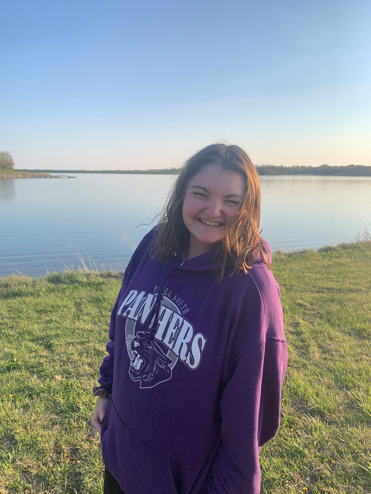

# Shelby Godding

My favorite song is Paradise by Coldplay. I heard it when I was young and always associated it with love. I've always imagined the right person for me will feel like the song Paradise. It's one of Coldplay's most popular songs. And while they are not my favorite band, this song will always hold a special place in my heart. 

---

### Book Reccomendations

Here are some books that I reccomend. They were all great reads. Take a chance with them. Try something new! It never hurts. Hopefully you'll enjoy them as much as I did.

|                 Book                  |                 Why I reccomend               |         Author        |
|                  ---                  |                      ---                      |          ---:         |
|            The Hunger Games           |               Dark but intriguing             |    Suzanne Collins    |
|   The Ballad of Songbirds and Snakes  |   Amazing prequel, interesting perspective    |     Suzanne Collins   |
|              Catching Fire            |            Characters get much deeper         |    Suzanne Collins    |
|           Life as we Knew it          |    Apocalyptic but so realistic and harsh     |   Susan Beth Pfeffer  |

--- 

### Favorite Quotes

> A friend may be waiting behind a stranger's face.

-Maya Angelou

> I never lose sight of the fact that just being is fun.

-Katherine Hepburn
